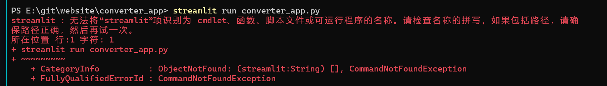

# Converter App

一个完整的、开箱即用的 Python 脚本，它使用 Streamlit 框架来创建一个带有 Web 界面的数值类型转换工具。

## 运行

```bash
streamlit run converter_app.py 
# 如果直接运行有问题，可以尝试使用以下命令
# 使用 python -m 来运行 Streamlit 模块
python -m streamlit run converter_app.py
```

一般正常情况下不能直接使用streamlit run converter_app.py运行，因为没有加入到环境变量中，所以需要使用python -m streamlit run converter_app.py来运行。

## 截图


